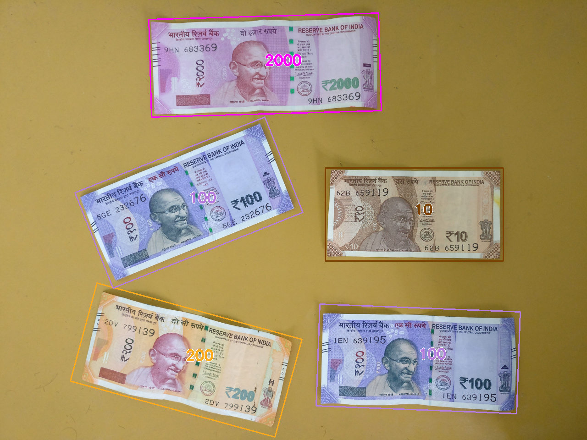

# Indian-Currency-Classification

This project is about classifying Indian currency notes using machine learning.
We trained a model with 1050 images of notes in 7 types: ₹10, ₹20, ₹50, ₹100, ₹200, ₹500, and ₹2000.

The program looks at:

the shape of the note

the texture (patterns)

the colors

and some important key points from the note’s image.

Using these details, a Random Forest model learns to tell which note it is.

When you give a new image, the program first finds the note in the picture and then predicts its value.


## Dependencies

* Python3, Scikit-learn
* Opencv+contrib, Mahotas
* Pickle, Joblib

## Demo

### How to run

```python
python bovw.py # Feature extraction
python hyper_train.py # Hyperparameter tuning
python train.py # Model training
python predict.py # Model inference
python currency.py # Currency classification
```

### Training Results

**Best Parameters:-**

```
bootstrap=True, criterion='gini',
min_samples_leaf=1, min_samples_split=2,
min_weight_fraction_leaf=0.0, n_estimators=200,
n_jobs=-1,verbose=1
```

**Cross Validation Accuracy**: 0.98 (+/- 0.01)

**Confusion Matrix:-**

|    | 10 | 20 | 50 | 100 | 200 | 500 | 2000|
|----|----|----|----|-----|-----|-----|-----|
| **10** | 28 | 0  |  1 |   0 |   2 |   0 |   0 |
| **20**  | 0  | 24 |  0 |   0 |   0 |   1 |   0 |
| **50**  | 0  | 0  | 27 |   0 |   0 |   0 |   0 |
| **100** | 0  | 0  |  0 |  32 |   0 |   0 |   0 |
| **200** | 2  | 0  |  0 |   0 |  31 |   0 |   0 |
| **500** | 0  | 1  |  0 |   0 |   0 |  26 |   0 |
| **2000**| 0  | 0  |  0 |   0 |   0 |   0 |  35 |


### Sample Output



